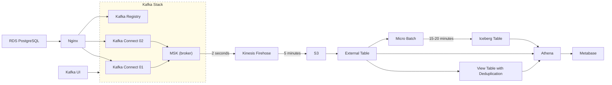

# Streamlake
End-to-end data pipeline framework built on AWS, integrating **Kafka Connect**, **Kafka Registry**,  **[Kafka Broker] MSK**, **Kinesis Firehose**, **S3 Data Lake**, **Athena**, and **micro-batching jobs**.  
Designed for scalable streaming ingestion, cost-efficient storage, and near real-time analytics.

## 🔄 Architecture Workflow

# KPI Scorecard
| KPI             | Weight | Green    | Amber       | Red         |
| --------------- | -----: | -------- | ----------- | ----------- |
| Success rate    |    30% | ≥ 99.5%  | 98–99.49%   | < 98%       |
| P95 runtime SLO |    20% | ≤ SLO    | ≤ 1.25× SLO | > 1.25× SLO |
| MTTR (median)   |    15% | ≤ 60 min | 60–120 min  | > 120 min   |
| On-time success |    15% | ≥ 98%    | 95–97.99%   | < 95%       |
| DQ pass rate    |    15% | ≥ 99%    | 98–98.99%   | < 98%       |
| DQ diff rate    |     5% | ≤ 0.10%  | 0.10–0.25%  | > 0.25%     |

# Objectives & Key Results (OKR)

| Objective | Key Result | Metric | Target |
|-----------|------------|--------|--------|
| **O1 — Reliable, predictable ETL runs**   *Why: Reduce fire-fighting; keep downstream analytics stable.* | KR1: Weekly pipeline success rate ≥ 99.5% | `success_count / total_jobs` from `status.json` (`extract_logs` CTE) | ≥ 99.5% per week, per job |
| | KR2: P95 runtime ≤ target (per critical job) | `P95(duration_seconds)` by job/day | ≤ 8 min (critical), ≤ 15 min (standard) |
| | KR3: MTTR ≤ 60 minutes | Median time from a failed run to the next successful run of the same job | ≤ 60 min weekly median |
| **O2 — Freshness & SLA adherence**   *Why: Business users trust “ready by X o’clock”.* | KR1: On-time completion ≥ 98% | % runs finishing before per-job SLA cutoff (WIB) | ≥ 98% per week |
| | KR2: Median freshness lag ≤ 15 minutes (or per job SLA) | `ended_at_utc - scheduled_time_utc` (or vs upstream window end) | ≤ 15 min median, ≤ 30 min P95 |
| **O3 — Data Quality you can bank on**   *Why: Correct numbers beat fast wrong numbers.* | KR1: DQ pass rate ≥ 99.0% | % rows in `monitoring.dq_runner_log` with `JOB_STATUS='OK'` **and** % checks in `monitoring.data_quality_check` with `status='OK'` | ≥ 99.0% per week |
| | KR2: Aggregate diff rate ≤ 0.10% | `SUM(ABS(diff)) / SUM(total_row_source)` | ≤ 0.10% over week/month |
| | KR3: DQ coverage ≥ 95% of prod tables | #tables with ≥1 DQ check today / #tables in scope | ≥ 95% daily |
| **O4 — Operational excellence (less toil, more flow)**   *Why: Scale without burning the team.* | KR1: Reruns per 100 jobs ≤ 1.0 | `(error_count / total_jobs) * 100` | ≤ 1.0 weekly |
| | KR2: Runtime improvement ≥ 10% vs last quarter | `median(duration_seconds)` trend (q/q) | ≥ 10% reduction for top N jobs by volume/criticality |
| | KR3: 100% jobs onboarded to runner | % of production jobs producing `status.json` daily | 100% |

