# Streamlake
End-to-end data pipeline framework built on AWS, integrating **Kafka Connect**, **Kafka Registry**,  **[Kafka Broker] MSK**, **Kinesis Firehose**, **S3 Data Lake**, **Athena**, and **micro-batching jobs**.  
Designed for scalable streaming ingestion, cost-efficient storage, and near real-time analytics.

## 🔄 Architecture Workflow

```mermaid
flowchart TD
  %% Source
  subgraph Source
    A["RDS PostgreSQL"]
  end

  %% Kafka Connect
  subgraph KafkaConnect["Kafka Connect"]
    B["CDC via Debezium"]
  end

  %% MSK
  subgraph MSK
    C["MSK - Kafka Topics"]
    Cnote(("JSON Schemas [Kafka Registry]"))
  end

  %% Firehose
  subgraph Firehose["Kinesis Firehose"]
    D["Dynamic Partitioning + Transform"]
  end

  %% S3 Data Lake
  subgraph S3["S3 Data Lake"]
    E["bronze · raw"]
    F["silver · cleansed & deduped"]
    G["gold · curated marts"]
  end

  %% Jobs
  subgraph Jobs
    H["Micro-Batching (Python)"]
    I["Batching (Python)"]
  end

  %% Athena
  subgraph Athena
    J["Athena Queries & Views"]
  end


  %% Metabase
  subgraph Metabase
    K["Metabase BI Tools"]
  end

  A --> B --> C --> D --> E
  C --> Cnote
  E --> H --> F
  F --> I --> G
  G --> J
  J --> K
```

