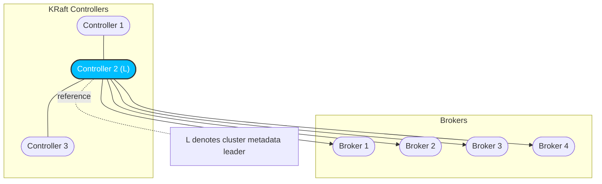

# MSK Clusters

```mermaid
flowchart TB
  %% ===== Controllers =====
  subgraph KRaft_Controllers["KRaft Controllers"]
    C1(["Controller 1"])
    C2(["Controller 2 (L)"])
    C3(["Controller 3"])
    C1 --- C2 --- C3
  end

  %% ===== Brokers =====
  subgraph Brokers
    B1(["Broker 1"])
    B2(["Broker 2"])
    B3(["Broker 3"])
    B4(["Broker 4"])
  end

  %% ===== Links =====
  C2 --> B1
  C2 --> B2
  C2 --> B3
  C2 --> B4

  %% ===== Styling =====
  classDef leader fill:#00BFFF,stroke:#333,stroke-width:2px,color:#fff;
  class C2 leader;

  %% ===== Legend =====
  Legend["L denotes cluster metadata leader"]
  C2 -. reference .- Legend

```
